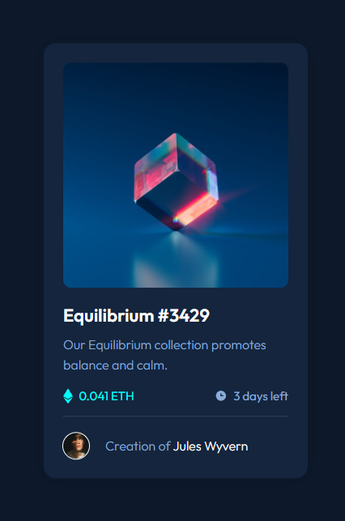
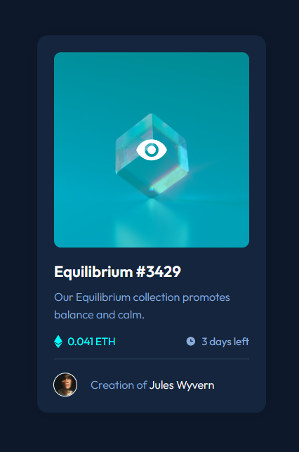

# Frontend Mentor - NFT preview card component solution

This is a solution to the [NFT preview card component challenge on Frontend Mentor](https://www.frontendmentor.io/challenges/nft-preview-card-component-SbdUL_w0U). Frontend Mentor challenges help you improve your coding skills by building realistic projects. 

## Table of contents

- [Overview](#overview)
  - [The challenge](#the-challenge)
  - [Screenshot](#screenshot)
  - [Links](#links)
- [My process](#my-process)
  - [Built with](#built-with)
  - [What I learned](#what-i-learned)
  - [Useful resources](#useful-resources)
- [Author](#author)

## Overview

### The challenge

Users should be able to:

- View the optimal layout depending on their device's screen size
- See hover states for interactive elements

### Screenshot

### Links

- Solution URL: [Github](https://github.com/daniloarcidiacono/frontendmentor-nftpreview)
- Live Site URL: [Github Pages](https://daniloarcidiacono.github.io/frontendmentor-nftpreview/)

## My process

### Built with

- Semantic HTML5 markup
- CSS custom properties
- Flexbox
- Sass

### What I learned

 - You can't use CSS properties within `@font-face` rules.
 - How to use Sass mixins to reuse code.

### Useful resources

- [Sass basics](https://sass-lang.com/guide) - Sass basics guide.
- [Reusing style with mixins](https://dev.to/mikkel250/reusing-style-with-mixins-lea) - Nice comparison between different strategies for reusing code with Sass.
- [Custom CSS properties in @font-face](https://stackoverflow.com/questions/58752373/custom-css-properties-in-font-face) - Caveat with CSS custom properties and `@font-face` rules.

## Author

- Github - [Danilo Arcidiacono](https://github.com/daniloarcidiacono)
- Frontend Mentor - [@daniloarcidiacono](https://www.frontendmentor.io/profile/daniloarcidiacono)
